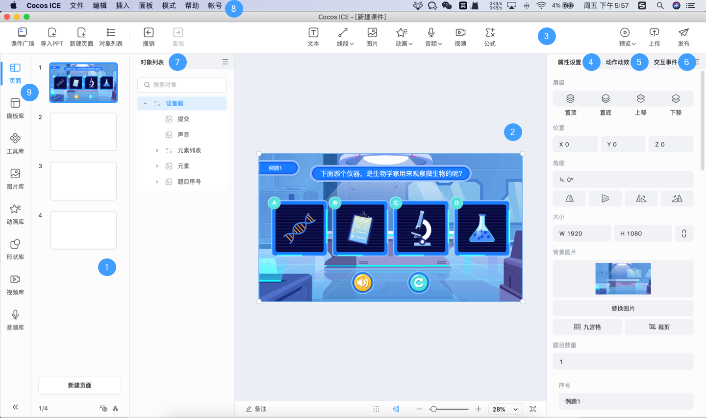

# 编辑器界面总览

Cocos ICE 的界面为高效的课件生产而设计。界面如图：

 

1. **课程页面**：展示当前的课程结构，可以在这里管理课程中的页面。详情请参考 [课程页面](../../page/index.md) 文档中的介绍。

2. **场景**：展示和编辑可视内容的工作区域。所见即所得的课程制作工作都依靠场景来完成。详情请参考 [场景](../../scene/index.md) 文档中的介绍。

3. **工具栏**：提供常用功能的快捷入口、基本对象插入、组件库和课程广场入口，同时工具栏也支持自定义。详情请参考 [工具栏](../../tools/index.md) 文档中的介绍。

4. **属性设置**：该面板展示和编辑当前在场景中选中的对象的属性，对象不同，对应的属性也不同。

5. **动作动效**：该面板展示和编辑当前选中对象的动作动效，可以选择出现、强调、消失 3 种类型的动效，支持设置延时、持续时间、重复次数、触发器，让课件更生动有趣。详情请参考 [动作动效](../../effect/index.md) 文档中的介绍。

6. **交互事件**：该面板展示和编辑当前选中对象的交互事件，可以配置触发器、触发结果、延时，让课件的交互性更强。详情请参考 [交互事件](../../event/index.md) 文档中的介绍。

7. **对象列表**：展示当前场景编辑器中所引用的所有对象、组件（由对象组成），支持选中编辑（选中后，可通过属性面板、事件面板进行配置）和删除操作。

8. **主菜单**：目前包括以下 6 个功能项：

    - **文件**：支持保存课程。
    - **编辑**：支持对编辑动作和内容的操作。
    - **插入**：支持向场景插入各种类型的对象。
    - **面板**：支持唤出所有面板、开发者工具，以及恢复默认布局。
    - **模式**：支持切换课程制作模式、互动视频制作模式、研发模式。
    - **帮助**：支持查看新手引导、用户手册、关于 Cocos ICE。
    - **账号**：支持退出当前账号。
